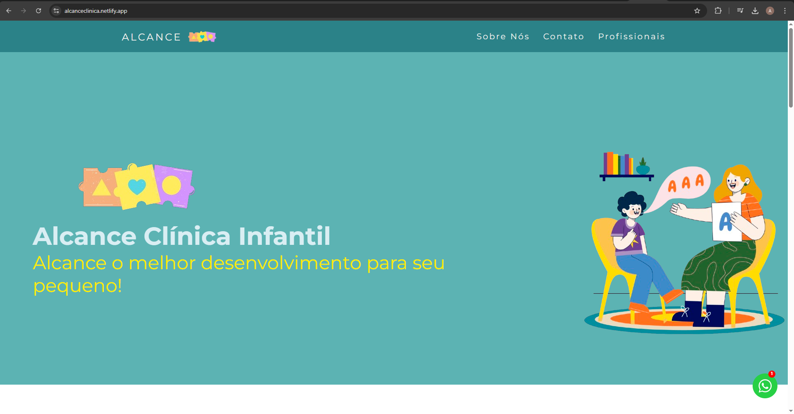
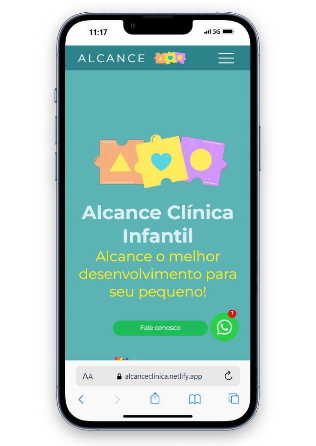

Landing Page para Clínica Alcance - Fonoaudiologia
Este projeto consiste na Landing Page desenvolvida para a Clínica Alcance, especializada em fonoaudiologia. A página foi criada como freela para proporcionar uma presença online clara e atraente para a clínica, com foco em informar os pacientes sobre os serviços oferecidos e facilitar o contato com os profissionais da clínica.

Tecnologias Utilizadas
HTML: Estrutura básica e semântica da página.
CSS: Estilização personalizada para uma aparência profissional e acolhedora.
JavaScript: Funcionalidades interativas, como formulários e animações simples.
A landing page foi projetada com o objetivo de ser simples, acessível e otimizada, garantindo que os visitantes encontrem facilmente informações sobre os serviços da clínica, bem como as formas de contato.

Funcionalidades
Design responsivo, adaptável a diferentes tamanhos de tela.
Apresentação clara dos serviços oferecidos pela clínica.
A página foi desenvolvida para ser de fácil manutenção e expansão, caso a clínica deseje adicionar novos serviços ou atualizações no futuro.

Link para ver projeto online: https://alcanceclinica.netlify.app/

